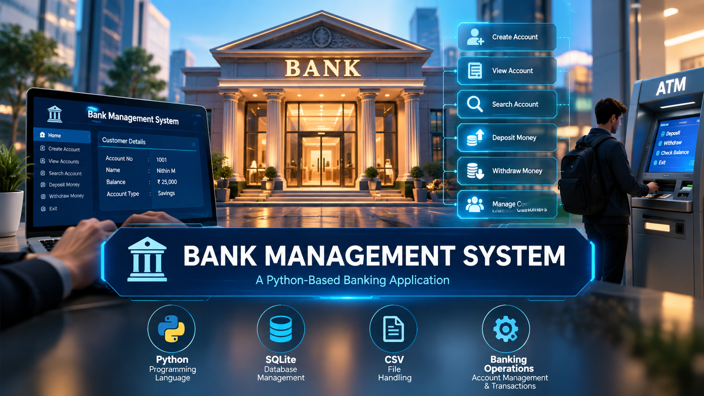

<div align="center">
  
# 🏦 Bank Management System



</div>

<br>

### A Python-Based Banking Application for Account and Transaction Management

<br>

The **Bank Management System** is a practical Python-based mini-project that simulates basic operations in a banking environment. The project provides a simple and structured way to create and manage customer accounts, store account information, search for existing records, and perform essential banking transactions such as depositing and withdrawing money.

The application is designed as a learning-oriented implementation of a small banking system. It shows how programming concepts such as **functions, conditional statements, loops, user input, data validation, file handling, database operations, and CRUD operations** combine to build a functional application.

The project also explores two different approaches to data storage. Customer and account information can be managed using **CSV files** for simple file-based storage, while the SQLite implementation provides a structured database-based approach for storing and retrieving records. This allows the project to demonstrate how application data can be maintained beyond the execution of the program.

The main purpose of developing this project is to gain practical experience in designing a menu-driven application, managing structured information, and implementing operations that resemble real-world banking workflows in a simplified educational environment.

<br>
<br>

## 📌 Project Overview

A banking application needs to maintain customer information accurately and provide operations for managing accounts and transactions. This project demonstrates a simplified version of such a system using Python.

The **Bank Management System** allows the user to interact with the application through a menu-driven interface. Depending on the selected operation, the program accepts the required information, processes the request, and displays the appropriate result.

For example, when creating an account, the application collects customer and account information and stores the record. When an existing account needs to be accessed, the user can search for the account and retrieve its stored information. Similarly, deposit and withdrawal operations modify the account balance according to the selected transaction.

The project also demonstrates the importance of data persistence. Instead of keeping all information only in program memory, account records can be stored using CSV files or an SQLite database. This means that information can be retrieved when the application is executed again.

The CSV implementation provides an easy way to understand structured file storage, while the SQLite implementation introduces database concepts such as tables, records, SQL queries, and database connections.

Overall, the project connects fundamental Python programming concepts with practical application development and provides a foundation for understanding how larger management systems can be designed.

<br>
<br>

## 🎯 Project Objectives

The main objective of this project is to develop a simple banking application while gaining practical experience in Python programming and data management.

The specific objectives are:

- To develop a menu-driven banking application using Python.
- To create and manage customer bank accounts.
- To store important customer and account information.
- To provide basic account search and viewing functionality.
- To implement deposit and withdrawal operations.
- To maintain account information between program executions.
- To understand file-based data storage using CSV.
- To understand database-based storage using SQLite.
- To practice Create, Read, Update and Delete operations.
- To apply data validation while accepting user information.
- To improve logical thinking and problem-solving skills.
- To understand how multiple programming concepts work together in a complete application.

<br>
<br>

## 💡 Problem Statement

Managing banking information manually can become difficult when the number of customers and transactions increases. A banking system needs a structured way to maintain account information, retrieve customer records, and perform transactions while keeping the stored data organized.

The objective of this project is to develop a simplified computer-based banking system that can perform common account management operations through a user-friendly menu-driven interface.

The system provides a basic foundation for understanding how banking-related information can be stored, retrieved, and modified using programming and database technologies.

This project is not intended to represent a production banking platform. Instead, it provides an educational implementation that demonstrates the programming logic behind basic account and transaction management.

<br>
<br>

## ✨ Features

### 👤 Account Management

The system provides functionality for managing customer accounts. Users can create new accounts by entering the required customer and account information. Existing account records can also be viewed or searched when required.

### 🔎 Account Search

The application allows users to search for an account using the available account information. This makes it easier to locate a particular customer's stored record without manually checking every entry.

### 💰 Deposit Money

The deposit operation allows the user to add money to an existing account. After the transaction is processed, the account information can be updated with the new balance.

### 💸 Withdraw Money

The withdrawal operation allows the user to remove money from an account while applying basic validation to the transaction.

### 📋 View Account Details

Users can retrieve and display stored account information through the application. This provides a simple way to check customer and account records.

### 💾 Persistent Data Storage

The project supports persistent storage using **CSV files and SQLite databases**, allowing account information to remain available after the program is closed.

<br>
<br>

## 🛠️ Technologies Used

### 🐍 Python

Python is used as the primary programming language for developing the application logic, handling user interaction, and implementing banking operations.

### 🗄️ SQLite

SQLite is used for database-based storage. It provides a structured way to store account information in tables and retrieve records using SQL queries.

### 📄 CSV

CSV is used for simple file-based data storage. It provides an easy-to-understand format for storing account information in rows and columns.

### 📂 File Handling

Python file-handling concepts are used to create, read, and manage stored data.

### 🔄 CRUD Operations

The project provides practical experience with Create, Read, Update, and Delete operations for managing application records.

<br>
<br>

## 🧠 Concepts Implemented

This project provides practical experience with the following programming concepts:

- Variables and data types
- Conditional statements
- Loops
- Functions
- User input
- Data validation
- String handling
- File handling
- CSV processing
- SQLite connectivity
- SQL queries
- Database operations
- CRUD operations
- Menu-driven programming
- Exception handling
- Basic application design
- Debugging and testing

<br>
<br>

## ⚙️ How the System Works

The application follows a menu-driven approach. When the program starts, the user is presented with the available banking operations.

The user selects an operation according to the required task. The application then collects the necessary information, validates the input, and performs the selected operation.

For account-related operations, the program either creates a new record or searches for an existing record. For transaction operations, the application retrieves the account information, performs the required calculation, and updates the stored data.

When the SQLite implementation is used, the information is maintained inside a database. When the CSV implementation is used, the information is maintained inside a structured CSV file.

A simplified workflow is:

```text
                 ┌───────────────────┐
                 │       Start       │
                 └─────────┬─────────┘
                           ↓
                 ┌───────────────────┐
                 │   Display Menu    │
                 └─────────┬─────────┘
                           ↓
                 ┌───────────────────┐
                 │ Select Operation  │
                 └─────────┬─────────┘
                           ↓
        ┌──────────────────┼──────────────────┐
        ↓                  ↓                  ↓
  Create Account      Search/View       Transactions
        │                  │             │
        ↓                  ↓             ├── Deposit
  Store Details       Retrieve Data      │
        │                  │             └── Withdraw
        └──────────────────┼──────────────────┘
                           ↓
                 ┌───────────────────┐
                 │ Update / Display  │
                 │      Result       │
                 └─────────┬─────────┘
                           ↓
                 ┌───────────────────┐
                 │   Return Menu     │
                 └─────────┬─────────┘
                           ↓
                 ┌───────────────────┐
                 │       Exit        │
                 └───────────────────┘
```

<br>
<br>

## 💾 Data Storage

One of the important learning aspects of this project is understanding how application data can be stored permanently.

### 📄 CSV Storage

The CSV-based implementation stores account information in a structured text file. Each row represents a record, and each column represents a particular field.

This approach is useful for understanding basic file handling and structured data management without requiring a separate database server.

### 🗄️ SQLite Storage

The SQLite implementation stores information in a database file. Account records can be organized into database tables and accessed using SQL queries.

SQLite provides a more structured approach to data management and helps demonstrate how Python applications interact with databases.

<br>
<br>

## 📂 Project Structure

```text
Bank-System/
│
├── bank.py
├── bank_sqlite.py
├── bank.csv
├── bank.db
└── README.md
```

### 📄 File Description

**`bank.py`**

The main Python implementation of the banking system. It contains the program logic for performing the supported banking operations.

**`bank_sqlite.py`**

The database-based implementation that uses SQLite for storing and retrieving banking records.

**`bank.csv`**

The CSV data file used for file-based storage of account information.

**` bank.db`**

The SQLite database file used to store structured banking records.

**`README.md`**

The documentation file contains information about the project, features, technologies, structure, and usage instructions.

<br>
<br>

## ▶️ How to Run

### Step 1: Install Python

Make sure Python is installed on your computer.

Check the installation using:

```bash
python --version
```

### Step 2: Clone the Repository

```bash
git clone https://github.com/your-username/your-repository.git
```

### Step 3: Open the Project Folder

```bash
cd Bank-System
```

### Step 4: Run the Python Program

For the basic implementation:

```bash
python bank.py
```

For the SQLite implementation:

```bash
python bank_sqlite.py
```

> Replace `your-username/your-repository` with the actual URL of your GitHub repository.

<br>
<br>

## 🖥️ Example Operations

The application can provide operations such as:

```text
1. Create Account
2. View Account
3. Search Account
4. Deposit Money
5. Withdraw Money
6. Exit
```

The exact menu options depend on the implementation contained in the Python files.

<br>
<br>

## 📚 Learning Outcomes

Developing this project provided practical experience in connecting programming concepts with a real-world-inspired application.

Through this project, I learned how to:

- Design a menu-driven Python application
- Organize program functionality using functions
- Accept and validate user input
- Manage customer and account information
- Implement basic transaction logic
- Read and write structured data
- Work with CSV files
- Connect Python programs with SQLite
- Create and retrieve database records
- Perform basic SQL operations
- Implement CRUD functionality
- Debug and test application logic
- Organize a project for GitHub

The project also helped me understand that developing an application involves more than writing individual pieces of code. Different programming concepts need to work together to create a complete and usable system.

<br>
<br>

## 🔮 Future Enhancements

The current project provides basic banking functionality, but it can be extended with additional features in the future.

Possible improvements include:

- 🔐 User authentication and login
- 🔑 PIN-based account access
- 📜 Complete transaction history
- 🧾 Account statement generation
- 💳 Fund transfer between accounts
- 📊 Transaction reports
- 👨‍💼 Administrator functionality
- 🖥️ Graphical User Interface
- 🌐 Web-based version
- 📱 Mobile-friendly application
- 🔒 Improved security and data protection
- 📈 Account and transaction analytics

These improvements would allow the project to gradually evolve from a basic learning application into a more complete banking management system.

<br>
<br>

## 🎓 Project Purpose

This project was developed as a **Python mini project** to gain practical experience in programming, data management, and database operations.

The project demonstrates how fundamental programming concepts can be applied to a real-world-inspired problem. It combines **Python programming, file handling, CSV processing, SQLite databases, CRUD operations, and user interaction** into a single application.

The primary purpose is educational and focuses on understanding application development concepts rather than implementing a production banking system.


<br>
<br>


</div>
