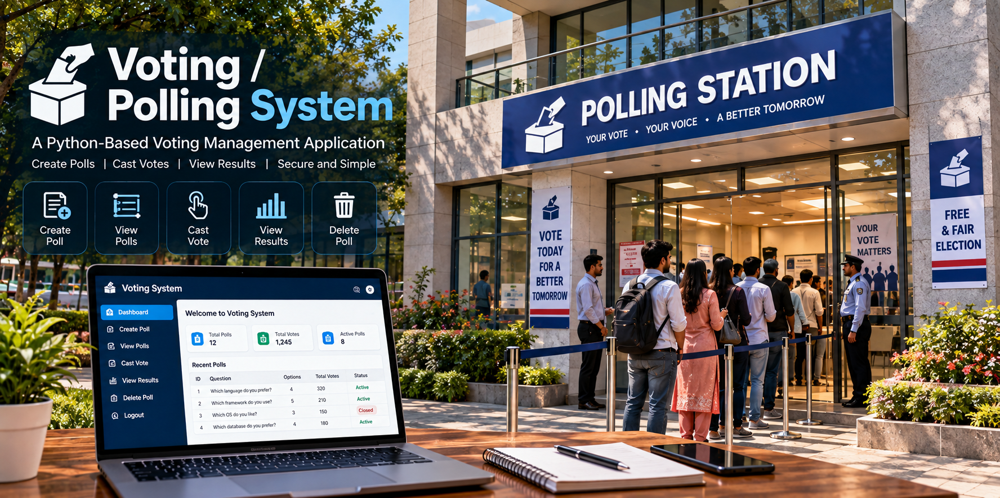

# 🗳️ Polling / Voting System

<div align="center">



</div>

<br>
<br>

### A Python-Based Poll Creation and Voting Management Application

The **Polling / Voting System** is a Python-based mini project developed to demonstrate how a simple digital polling application can be designed using Python, file handling, CSV storage and SQLite database management. The system provides a structured way to create polls, add multiple options, view available polls, cast votes, prevent duplicate voting, display voting results and delete existing polls through a simple menu-driven interface.

The project contains two implementations of the same polling system. The first implementation uses **CSV files** to store poll questions, poll options, vote counts and voter information. The second implementation uses an **SQLite database** to store the same information using relational database tables and SQL operations.

The application begins with a menu-driven interface where users can create a new poll by entering a question and defining multiple options. Each poll receives a unique poll ID, which can later be used to view the poll, vote on it or display its results.

When voting, the system asks the voter to enter their name and select an option. Before recording the vote, the application checks whether the same voter has already voted on that particular poll. If the voter has already participated, another vote is not recorded.

After votes are submitted, the system calculates the total number of votes and the percentage received by every option. This allows the application to display clear and understandable polling results.

The project also demonstrates basic data management operations. Users can create polls, view stored information, update vote counts through voting and delete polls together with their associated records.

This project was developed as part of my **Python Mini Projects** collection to strengthen programming fundamentals and gain practical experience with Python, CSV file handling and SQLite database management.

> ⚠️ **Educational Notice:** This project is intended for learning and demonstration purposes. It is not designed for official elections or high-security voting systems.


---

## 📌 Project Overview

The **Polling / Voting System** is a command-line application that allows users to create and manage polls.

When the program starts, it displays a menu containing options for creating polls, viewing polls, voting, viewing results, deleting polls and exiting the application.

The **Create Poll** option allows users to enter a poll question and define multiple options. The system requires at least two options before a poll can be created.

After a poll is created, the system assigns a unique poll ID and stores the question and its options.

The **View All Polls** option displays all available polls along with their IDs. Users can use these IDs to select a poll.

The **Vote** option allows users to select a poll, enter their name and choose an option. The system checks whether the voter has already participated in that poll before accepting the vote.

The **View Results** option calculates the total number of votes and the percentage received by each option.

The **Delete Poll** option allows an existing poll to be removed along with its related data.

The program continues running until the user chooses the Exit option.

---

## 💡 Problem Statement

Polling is a common method of collecting opinions or choices from a group of people. Managing polls manually can become difficult when there are multiple questions, options and participants.

A computerized polling system can simplify this process by providing a structured method for creating polls, collecting votes, storing voter information and calculating results.

The objective of this project is to develop a Python-based Polling / Voting System that allows users to:

- Create polls.
- Add multiple options.
- View available polls.
- Participate in polls.
- Record voter information.
- Prevent duplicate voting on the same poll.
- Maintain vote counts.
- Calculate voting percentages.
- Display polling results.
- Delete polls.
- Store information using CSV files.
- Store information using SQLite.

---

## 🎯 Objectives

The main objectives of this project are:

- To develop a simple polling application using Python.
- To create polls dynamically.
- To allow multiple options for every poll.
- To assign unique IDs to polls.
- To display available polls.
- To allow users to cast votes.
- To record voter information.
- To prevent duplicate voting on the same poll.
- To maintain vote counts.
- To calculate total votes.
- To calculate voting percentages.
- To display polling results.
- To delete existing polls.
- To practice file handling.
- To understand CSV storage.
- To understand SQLite database management.
- To implement input validation.
- To strengthen programming and problem-solving skills.

---

## ✨ Features

### 📝 Create Poll

The system allows users to create a new poll by entering a question and adding multiple options.

Example:

```text
Enter Poll Question: Which programming language do you prefer?

How many options? (min 2): 4

Enter Option 1: Python
Enter Option 2: Java
Enter Option 3: C++
Enter Option 4: JavaScript

Poll created successfully! Poll ID: 1
```

The system validates the question and requires at least two non-empty options.

---

### 📋 View All Polls

Users can view all available polls.

```text
----------- ALL POLLS -----------

ID    Question
1     Which programming language do you prefer?
2     Which database do you use most?
3     Which development area interests you?
```

The poll ID can be used for voting or viewing results.

---

### 🗳️ Vote on a Poll

Users can select a poll and cast a vote.

```text
Enter Poll ID to Vote On: 1

Which programming language do you prefer?

  1. Python
  2. Java
  3. C++
  4. JavaScript

Enter Your Name: Nithin
Enter Option ID to Vote: 1

Vote cast successfully!
```

---

### 🚫 Duplicate Vote Prevention

Before accepting a vote, the system checks whether the voter has already participated in the selected poll.

```text
You have already voted on this poll.
```

The system does not record another vote for the same voter on that poll.

> **Note:** Voters are identified using their entered name, so this is only a basic educational duplicate-prevention mechanism.

---

### 📊 View Results

The system displays the number and percentage of votes received by every option.

```text
----------- RESULTS -----------

Option                  Votes      Percent
Python                  12         60.0%
Java                    4          20.0%
C++                     3          15.0%
JavaScript              1           5.0%

Total Votes: 20
```

The percentage is calculated using:

```text
Percentage = (Option Votes / Total Votes) × 100
```

---

### 🗑️ Delete Poll

Users can delete an existing poll using its poll ID.

```text
Enter Poll ID to Delete: 1

Poll deleted successfully!
```

The associated option and voter records are also removed.

---

### 💾 CSV Storage

The CSV version stores data in three files:

```text
polls.csv
options.csv
voters.csv
```

These files store poll information, options and voter records separately.

---

### 🗄️ SQLite Storage

The SQLite version stores all polling information in:

```text
voting.db
```

The database contains:

```text
polls
options
voters
```

tables.

---

### 🔄 Menu-Driven Interface

The application provides a simple menu:

```text
========== POLLING / VOTING SYSTEM ==========

1. Create Poll
2. View All Polls
3. Vote
4. View Results
5. Delete Poll
6. Exit

Enter your choice:
```

---

### ✅ Input Validation

The system validates:

- Poll questions.
- Number of options.
- Option text.
- Poll IDs.
- Voter names.
- Option IDs.
- Menu choices.

This helps prevent invalid information from being stored.

---

## 🛠️ Technologies Used

### 🐍 Python

Python is used as the primary programming language for implementing the entire polling system.

It handles user interaction, poll management, voting, result calculation, validation and data storage.

### 📄 CSV

The Python `csv` module is used for the file-based implementation.

### 🗄️ SQLite

The Python `sqlite3` module is used for the database-based implementation.

### 💻 Command-Line Interface

The project uses a terminal-based interface for user interaction.

---

## 🧠 Programming Concepts Used

The project provides practical experience with:

- Variables and data types
- User input
- Type conversion
- Conditional statements
- `if`, `elif` and `else`
- `while` loops
- `for` loops
- Functions
- Lists
- Dictionaries
- File handling
- CSV processing
- SQLite
- SQL queries
- CRUD operations
- Input validation
- Data processing
- Vote counting
- Percentage calculation
- Menu-driven programming
- Error handling
- Problem solving

---

## ⚙️ How the System Works

When the application starts, the required storage system is initialized.

For the CSV version, the required CSV files are created if they do not already exist.

For the SQLite version, the required database tables are created if they do not already exist.

The main menu is displayed after initialization.

The user can select one of the available operations.

### Step 1: Create Poll

The user enters a question and specifies the number of options.

The system validates the information and stores the poll.

### Step 2: View Polls

The application displays all available polls and their IDs.

### Step 3: Vote

The user selects a poll, enters their name and chooses an option.

The system checks whether the voter has already voted on that poll.

If the voter has not voted, the selected option's vote count is increased.

### Step 4: View Results

The system retrieves the vote counts and calculates the percentage received by each option.

### Step 5: Delete Poll

The selected poll and its related records are removed.

### Step 6: Exit

The application terminates when the user selects Exit.

---

## 🔄 Polling System Flow

```text
                 ┌───────────────────┐
                 │       Start       │
                 └─────────┬─────────┘
                           ↓
                 ┌───────────────────┐
                 │ Initialize Data   │
                 │ CSV / SQLite      │
                 └─────────┬─────────┘
                           ↓
                 ┌───────────────────┐
                 │    Display Menu   │
                 └─────────┬─────────┘
                           ↓
        ┌──────────────────┼──────────────────┐
        ↓                  ↓                  ↓
   Create Poll         View Polls           Vote
        ↓                  ↓                  ↓
   Add Options        Select Poll        Enter Name
        ↓                                     ↓
   Save Poll                              Check Voter
        ↓                                     ↓
        └──────────────────┬──────────────────┘
                           ↓
                    View Results
                           ↓
                  Calculate Results
                           ↓
                    Delete Poll
                           ↓
                         Exit
```

---

## 📂 Project Structure

```text
Polling-Voting-System/
│
├── voting_csv.py
├── voting_sqlite.py
│
├── polls.csv
├── options.csv
├── voters.csv
│
├── voting.db
│
├── polling-voting-system.png
│
└── README.md
```

---

## 📄 File Description

### `voting_csv.py`

Contains the CSV-based implementation of the Polling / Voting System.

It manages:

```text
Create Poll
View All Polls
Vote
View Results
Delete Poll
Exit
```

The program uses `polls.csv`, `options.csv`, and `voters.csv` for persistent storage.

---

### `voting_sqlite.py`

Contains the SQLite-based implementation of the Polling / Voting System.

It uses `voting.db` as the database and stores information in the `polls`, `options`, and `voters` tables.

---

### `polls.csv`

Stores poll questions.

```text
ID, Question
```

Example:

```text
1. Which programming language do you prefer?
2. Which database do you use most?
```

---

### `options.csv`

Stores the options associated with each poll.

```text
ID, PollID, OptionText, Votes
```

Example:

```text
1,1, Python,10
2,1, Java,5
3,1,C++,3
```

---

### `voters.csv`

Stores voter participation.

```text
PollID, VoterName
```

Example:

```text
1, Nithin
1, Rahul
1, Priya
```

---

### `voting.db`

SQLite database used by the database implementation.

It stores:

```text
polls
options
voters
```

---

### `polling-voting-system.png`

The main visual image used in the README to represent the Polling / Voting System Python Mini Project.

---

### `README.md`

The documentation file containing complete information about the project, including its objectives, features, technologies, working process, project structure, execution instructions, learning outcomes and future enhancements.

---

## ▶️ How to Run

### Step 1: Install Python

```bash
python --version
```

### Step 2: Open the Project Folder

```bash
cd Polling-Voting-System
```

### Step 3: Run the CSV Version

```bash
python voting_csv.py
```

### Step 4: Run the SQLite Version

```bash
python voting_sqlite.py
```

No separate SQLite installation is required because Python provides the `sqlite3` module.

---

## 💻 Example Usage

### Creating a Poll

```text
========== POLLING / VOTING SYSTEM ==========

1. Create Poll
2. View All Polls
3. Vote
4. View Results
5. Delete Poll
6. Exit

Enter your choice: 1

Enter Poll Question: Which programming language do you prefer?

How many options? (min 2): 4

Enter Option 1: Python
Enter Option 2: Java
Enter Option 3: C++
Enter Option 4: JavaScript

Poll created successfully! Poll ID: 1
```

### Viewing Polls

```text
Enter your choice: 2

----------- ALL POLLS -----------

ID    Question
1.     Which programming language do you prefer?
```

### Voting

```text
Enter your choice: 3

Enter Poll ID to Vote On: 1

Which programming language do you prefer?

  1. Python
  2. Java
  3. C++
  4. JavaScript

Enter Your Name: Nithin
Enter Option ID to Vote: 1

Vote cast successfully!
```

### Duplicate Voting

```text
Enter Your Name: Nithin

You have already voted on this poll.
```

### Viewing Results

```text
Enter your choice: 4

Enter Poll ID to View Results: 1

----------- RESULTS -----------

Option                  Votes      Percent
Python                  1          100.0%
Java                    0            0.0%
C++                     0            0.0%
JavaScript              0            0.0%

Total Votes: 1
```

### Deleting a Poll

```text
Enter your choice: 5

Enter Poll ID to Delete: 1

Poll deleted successfully!
```

---

## 💾 Data Storage

The project demonstrates two different approaches to persistent storage.

### CSV-Based Storage

```text
polls.csv
options.csv
voters.csv
```

Each file stores a different category of polling information.

This approach demonstrates basic file handling and structured text-based data storage.

### SQLite-Based Storage

```text
voting.db
```

The SQLite version organizes the information into relational tables:

```text
polls
   │
   ├── options
   │
   └── voters
```

This approach demonstrates how related information can be maintained using a database.

---

## 📊 Result Calculation

The system calculates the percentage of votes received by each option.

```text
Percentage = (Option Votes / Total Votes) × 100
```

Example:

```text
Total Votes = 20
Python Votes = 12

Percentage = (12 / 20) × 100
            = 60%
```

If there are no votes, the percentage is displayed as `0%`.

---

## 🔐 Voting Rules

```text
1. A poll must contain at least two options.
2. Poll questions cannot be empty.
3. Option text cannot be empty.
4. Voter names cannot be empty.
5. A voter cannot vote twice on the same poll using the same name.
6. The selected option must belong to the selected poll.
7. Invalid poll IDs are rejected.
8. Invalid option IDs are rejected.
```

The application is an educational project and should not be used as a secure election system.

---

## 🗄️ Database Design

### Polls Table

```text
polls
-------------------------
id
question
```

Stores the main poll information.

### Options Table

```text
options
-------------------------
id
poll_id
option_text
votes
```

Stores poll options and their vote counts.

### Voters Table

```text
voters
-------------------------
id
poll_id
voter_name
```

Stores voter participation information.

---

## 🧪 Input Validation

The system validates user input before processing operations.

```text
Question cannot be empty!
```

```text
You must enter at least 2 options.
```

```text
Option text cannot be empty.
```

```text
Invalid Poll ID.
```

```text
Name cannot be empty!
```

```text
Invalid Option ID.
```

```text
Invalid Choice! Please try again.
```

These validations help maintain valid and consistent data.

---

## 📚 Learning Outcomes

Developing this project provided practical experience in converting a real-world polling requirement into a complete Python application.

The project helped me understand how questions and multiple-choice options can be represented programmatically and stored for later use.

It provided hands-on practice with Python functions, loops, conditional statements, lists, user input, and validation.

The CSV implementation provided practical experience with file handling. Polls, options, vote counts, and voter records are maintained in separate CSV files.

The SQLite implementation provided experience with relational database management and SQL operations.

The project also provided practical experience with duplicate-vote checking, vote counting, and percentage calculations.

Through this project, I gained practical understanding of:

```text
Python Programming
Functions
Loops
Conditional Statements
Lists
Input Validation
File Handling
CSV Processing
SQLite
SQL Queries
Database Tables
CRUD Operations
Database Constraints
Vote Counting
Percentage Calculation
Menu-Driven Applications
Data Management
Problem Solving
```

---

## 🔮 Future Enhancements

Possible future improvements include:

- 👤 User registration and login
- 🔐 Password authentication
- 🪪 Stronger voter verification
- ⏱️ Poll start and end dates
- 🔒 Poll closing functionality
- 📊 Graphical voting charts
- 📈 Advanced voting statistics
- 🏆 Automatic winner identification
- 🔍 Poll searching
- ✏️ Poll editing
- 📝 Poll descriptions
- 🖼️ Image-based options
- 🌐 Web-based interface
- 📱 Mobile application
- ☁️ Cloud database support
- 📧 Email notifications
- 📤 CSV/PDF result export
- 🛡️ Improved security
- 📋 Voting audit logs
- 👨‍💼 Administrator dashboard

---

## 🎓 Project Purpose

This project was developed as part of my **Python Mini Projects** collection to strengthen programming fundamentals through practical implementation.

The Polling / Voting System demonstrates how a real-world requirement can be converted into a structured software application using Python.

The complete process can be represented as:

```text
Poll Creation
      ↓
Option Management
      ↓
Voter Participation
      ↓
Duplicate Vote Checking
      ↓
Vote Counting
      ↓
Result Calculation
      ↓
Poll Management
```

The project provides both CSV and SQLite implementations, making it useful for understanding different approaches to persistent data storage.

The project is primarily intended for **learning and educational purposes** and provides a foundation for developing more advanced polling and survey applications.

---


</div>
