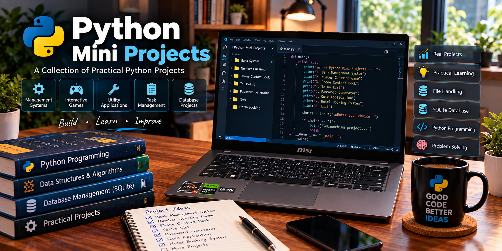

# 💻 Python Mini Projects

### 🚀 A Collection of Practical Python Projects

**Building • Learning • Improving**

 

 

---

## 📖 About This Repository

Welcome to my **Python Mini Projects** repository, a collection of practical applications created as part of my continuous programming and software development learning journey.

This repository represents my approach to learning programming through **hands-on project development**. Instead of limiting my learning to theoretical concepts and individual coding exercises, I use mini projects to understand how programming concepts can be combined to create complete, working applications. Each project focuses on a specific problem or use case and gives me an opportunity to design program logic, write code, handle user input, manage data and test the application.

The projects in this repository cover different programming concepts and application areas, including **management systems, interactive games, utility applications, task management, contact management, quiz applications and booking systems**. Some projects also involve **file handling, CSV data, SQLite databases and CRUD operations**, providing practical experience in working with persistent data.

### 🧠 What I Learn Through These Projects

- 🐍 **Python Programming**  
  Applying variables, data types, operators, conditional statements, loops, functions, strings, lists and other core Python concepts.

- 📄 **Data & File Handling**  
  Learning how applications can create, read, update and manage information stored in files and structured formats such as CSV.

- 🗄️ **Database Management**  
  Using SQLite to understand how applications store structured information and retrieve data when required.

- 🔄 **CRUD Operations**  
  Implementing Create, Read, Update and Delete operations in applications that manage records and information.

- 🧠 **Problem Solving**  
  Breaking problems into smaller components, designing logical solutions and converting those solutions into working programs.

- ⌨️ **User Interaction**  
  Handling user input, validating information and displaying meaningful output through interactive applications.

- 🐛 **Debugging & Improvement**  
  Finding errors, testing different situations and improving programs through continuous practice.

### 🎯 Purpose of This Repository

The main purpose of this repository is to maintain a structured record of my practical programming experience. Each project represents a step in my learning process and allows me to apply concepts that I have studied in a practical environment.

These projects also help me understand the development process, from identifying a problem and planning a solution to implementing the program, testing its functionality and organizing the source code.

### 🚀 Future Direction

This repository will continue to grow as my technical skills develop. Future projects may include **advanced Python applications, database-driven systems, AI-based applications, automation tools, web applications and larger software projects**.

My goal is to gradually progress from small learning projects toward developing more complete and practical software applications.

 
 

# 🚀 Projects

<table>
<tr>

<td width="50%" valign="top">

### 🏦 Bank Management System

A Python-based application for managing bank accounts and performing basic banking operations.

**Tech Stack**

`Python` `SQLite` `CSV`

**Key Concepts**

Account Management • Database Operations • Data Handling

🔗 **[View Project →](./Bank-System)**

</td>

<td width="50%" valign="top">

### 🎯 Number Guessing Game

An interactive game where the user attempts to guess a randomly generated number.

**Tech Stack**

`Python`

**Key Concepts**

Random Numbers • Loops • Conditions • User Input

🔗 **[View Project →](./Number-Guessing)**

</td>

</tr>

<tr>

<td width="50%" valign="top">

### 📱 Phone Contact Book

An application for storing, searching and managing phone contact information.

**Tech Stack**

`Python`

**Key Concepts**

Data Management • Functions • File Handling

🔗 **[View Project →](./Phone-Contact-Book)**

</td>

<td width="50%" valign="top">

### ✅ To-Do List

A simple task management application for organizing daily activities.

**Tech Stack**

`Python`

**Key Concepts**

Lists • Functions • Task Management • User Input

🔗 **[View Project →](./To-Do-List)**

</td>

</tr>

<tr>

<td width="50%" valign="top">

### 🔐 Password Generator & Manager

A utility application for generating passwords and managing password-related information.

**Tech Stack**

`Python`

**Key Concepts**

Random Generation • Strings • Data Handling

🔗 **[View Project →](./Password-Generator-Manager)**

</td>

<td width="50%" valign="top">

### 🧠 Quiz Application

An interactive quiz application that presents questions and calculates the final score.

**Tech Stack**

`Python`

**Key Concepts**

Questions • Conditions • Score Calculation • User Interaction

🔗 **[View Project →](./Quiz)**

</td>

</tr>

<tr>

<td width="50%" valign="top">

### 🏨 Hotel Booking System

A Python application for managing hotel booking information and customer details.

**Tech Stack**

`Python`

**Key Concepts**

Booking Management • Data Handling • Application Logic

🔗 **[View Project →](./Hotel-Booking)**

</td>

<td width="50%" valign="top">

### 📚 More Projects Coming Soon

This repository will continue to grow as I develop more projects and explore new technologies.

**Planned Areas**

🐍 Python Applications  
🗄️ Database Projects  
🤖 AI Projects  
💻 Larger Software Applications

</td>

</tr>
</table>

 
 

# 🛠️ Technologies & Tools

  

**Python** &nbsp; • &nbsp;
**SQLite** &nbsp; • &nbsp;
**Git** &nbsp; • &nbsp;
**GitHub** &nbsp; • &nbsp;
**VS Code**

 
 

# 📊 What I Practice

<table align="center">

<tr>
<td align="center" width="650">

### 🐍 Python Programming

I practice variables, data types, functions, loops, conditions, strings, lists and core Python programming concepts.

</td>
</tr>

<tr>
<td align="center">

**⬇️**

</td>
</tr>

<tr>
<td align="center" width="650">

### 📄 File & Data Handling

I work with files and structured data to store, read, update and manage information.

</td>
</tr>

<tr>
<td align="center">

**⬇️**

</td>
</tr>

<tr>
<td align="center" width="650">

### 🗄️ Database Management

I use SQLite to understand tables, records, queries and application data storage.

</td>
</tr>

<tr>
<td align="center">

**⬇️**

</td>
</tr>

<tr>
<td align="center" width="650">

### 🔄 CRUD Operations

I practice Create, Read, Update and Delete operations through management applications.

</td>
</tr>

<tr>
<td align="center">

**⬇️**

</td>
</tr>

<tr>
<td align="center" width="650">

### 🧠 Problem Solving

I break problems into smaller steps and develop logical programming solutions.

</td>
</tr>

<tr>
<td align="center">

**⬇️**

</td>
</tr>

<tr>
<td align="center" width="650">

### ⌨️ User Interaction

I practice user input, validation and meaningful output through interactive applications.

</td>
</tr>

</table>

 
 

# 📈 Learning Journey

<table align="center">

<tr>
<td align="center" width="600">

### 01 · 🐍 Learn Python

Build a strong foundation in Python programming.

</td>
</tr>

<tr>
<td align="center">

**⬇️**

</td>
</tr>

<tr>
<td align="center" width="600">

### 02 · 💡 Understand Concepts

Learn how programming concepts work and how they can be applied to solve problems.

</td>
</tr>

<tr>
<td align="center">

**⬇️**

</td>
</tr>

<tr>
<td align="center" width="600">

### 03 · 🛠️ Build Mini Projects

Apply programming knowledge by creating practical applications.

</td>
</tr>

<tr>
<td align="center">

**⬇️**

</td>
</tr>

<tr>
<td align="center" width="600">

### 04 · 🧠 Solve Problems

Improve logical thinking and develop solutions to programming problems.

</td>
</tr>

<tr>
<td align="center">

**⬇️**

</td>
</tr>

<tr>
<td align="center" width="600">

### 05 · 🗄️ Explore Databases & Tools

Learn SQLite, Git, GitHub and other development tools.

</td>
</tr>

<tr>
<td align="center">

**⬇️**

</td>
</tr>

<tr>
<td align="center" width="600">

### 06 · 🚀 Build Larger Projects

Combine different concepts to develop more complete applications.

</td>
</tr>

<tr>
<td align="center">

**⬇️**

</td>
</tr>

<tr>
<td align="center" width="600">

### 07 · 💻 Develop Real-World Applications

Use the knowledge gained to build useful and practical software applications.

</td>
</tr>

</table>

 
 
 

# 🎯 Purpose

The purpose of this repository is to document my practical programming journey and maintain a collection of projects that demonstrate my learning and development.

Through these projects, I aim to:

- Strengthen my Python programming fundamentals
- Improve logical and problem-solving skills
- Gain practical development experience
- Understand file handling and databases
- Practice CRUD operations
- Learn Git and GitHub
- Build a strong project portfolio
- Track my technical learning progress

 
 

# 👨‍💻 About Me

### Nithin M

I am a **Computer Science & Engineering student** interested in software development and emerging technologies.

I enjoy learning programming by building practical projects and applying concepts through hands-on development. Working on projects helps me understand how applications are designed, how data is managed and how different programming concepts work together to create useful software.

My main areas of interest include **Software Development, Python, Artificial Intelligence, Problem Solving, Data and Technology**. I enjoy exploring new programming concepts and applying them through projects that allow me to learn beyond classroom theory.

Building these mini projects has helped me improve my understanding of programming fundamentals, logical thinking, data handling and application development. I am continuously working on improving my technical skills by learning new technologies, solving programming problems, developing projects and exploring different areas of software development.

My goal is to gradually progress from small learning projects to larger and more complete applications while continuing to strengthen my programming and problem-solving abilities.

### 💡 Areas of Interest

💻 Software Development  
🐍 Python  
🤖 Artificial Intelligence  
🧠 Problem Solving  
📊 Data & Technology

 
 

## 📌 Repository Highlights

This repository currently contains **7 Python mini projects** covering different areas of practical programming and application development.

**Primary Language:** Python  
**Database:** SQLite  
**Data Handling:** CSV & File Handling  
**Version Control:** Git & GitHub  
**Development Environment:** VS Code  
**Project Type:** Practical Python Mini Projects

The projects range from simple programming exercises and interactive applications to management-oriented systems involving data storage and database operations.

 
 

# ⭐ Repository

If you find these projects useful or interesting, consider giving this repository a ⭐.

**Your support helps me continue learning, building and improving.**

⭐ **Star this repository if you find it useful!** ⭐

### 💡 Learn • Build • Improve

*Made with ❤️ using Python*

