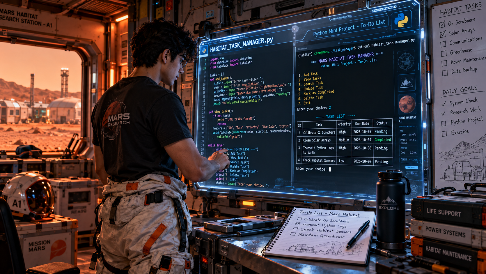

# 📝 To-Do List

### A Python-Based Task Management Application

The **To-Do List** is a Python-based mini project developed to help users organize, manage, and track their daily tasks in a simple and structured way. The application provides an interactive command-line interface through which users can create tasks, view existing tasks, mark tasks as completed, update task information, and delete tasks that are no longer required.

Managing multiple tasks without a proper system can make it difficult to remember pending work, track completed activities, and prioritize important tasks. This project provides a simple digital solution by allowing users to maintain their tasks in one centralized application.

The project demonstrates how fundamental Python programming concepts can be combined to create a practical task management application. It makes use of **variables, functions, conditional statements, loops, user input, file handling, data validation, and database operations** to provide a complete working system.

The project contains two implementations using different data storage techniques. The **CSV version** stores task information in a CSV file, while the **SQLite version** stores tasks inside a local SQLite database. Both implementations provide similar task management functionality while demonstrating different approaches to persistent data storage.

This project was developed as part of my **Python Mini Projects** collection to strengthen programming fundamentals through practical implementation and to understand how a simple task management problem can be converted into a complete Python application.

<br>
<br>

<div align="center">



</div>

<br>
<br>

## 📌 Project Overview

The To-Do List is a menu-driven task management application designed to help users maintain a digital list of activities that need to be completed.

When the application starts, the user is presented with a menu containing different task management operations. The user can add a new task, view all available tasks, search for a particular task, update task information, mark a task as completed, or delete an unwanted task.

Each task can contain important information such as a task title, description, priority, due date, and completion status. The stored information allows the user to keep track of both pending and completed activities.

The application is designed around the basic **CRUD operations — Create, Read, Update, and Delete**. In addition to CRUD functionality, the project introduces task completion tracking, allowing users to distinguish between tasks that are still pending and tasks that have already been completed.

The project provides two different implementations. The CSV version uses file handling to store task records, while the SQLite version uses a relational database and SQL operations.

This makes the project useful not only as a basic task management application but also as a practical example of how Python applications can work with different types of persistent data storage.

<br>
<br>

## 💡 Problem Statement

Managing daily activities, academic work, project tasks, and personal responsibilities can become difficult when there are many tasks to remember.

Without a proper task management system, users may forget pending activities, lose track of deadlines, or have difficulty identifying which tasks have already been completed.

The objective of this project is to develop a simple Python-based To-Do List application that allows users to digitally organize and manage their tasks.

The system should provide functionality for:

- Creating new tasks.
- Viewing existing tasks.
- Searching for specific tasks.
- Updating task information.
- Marking tasks as completed.
- Deleting unnecessary tasks.
- Tracking pending and completed tasks.
- Storing task information permanently.
- Maintaining data using CSV or SQLite storage.

The project focuses on providing a simple interface while demonstrating practical programming and data management concepts.

<br>
<br>

## 🎯 Objectives

The main objective of this project is to develop a practical task management application using Python.

The specific objectives are:

- To develop a simple digital task management system.
- To allow users to create and store tasks.
- To display previously stored tasks.
- To search for specific tasks.
- To update existing task information.
- To mark tasks as completed.
- To identify pending tasks.
- To delete tasks that are no longer required.
- To implement input validation.
- To understand file-based data storage using CSV.
- To understand database-based storage using SQLite.
- To implement CRUD operations.
- To understand persistent data management.
- To improve logical thinking and problem-solving skills.
- To gain practical experience in developing menu-driven applications.

<br>
<br>

## ✨ Features

### ➕ Add Task

The **Add Task** feature allows the user to create a new task and store it in the system.

The application can collect information such as the task title, description, priority, and due date. Before saving the task, the program can validate the entered information to ensure that required details are available.

Once the information is accepted, the task is stored using the selected storage method.

This operation represents the **Create** operation in CRUD.

---

### 👀 View Tasks

The **View Tasks** feature displays the tasks currently stored in the application.

The user can view the complete task list and understand which activities are pending and which have already been completed.

The information can be displayed in an organized format containing details such as task ID, title, priority, due date, and status.

This operation represents the **Read** operation in CRUD.

---

### 🔍 Search Task

The **Search Task** feature allows users to quickly locate a particular task without manually checking every record.

The user can search using information such as the task title or keyword.

The application searches the stored records and displays matching tasks.

This feature becomes particularly useful when the number of stored tasks increases.

---

### ✏️ Update Task

The **Update Task** feature allows users to modify existing task information.

For example, a user may need to change a task title, description, priority, or due date.

Instead of deleting the existing task and creating a new one, the application allows the existing record to be modified.

This operation represents the **Update** operation in CRUD.

---

### ✅ Mark Task as Completed

The **Mark as Completed** feature allows the user to change the status of a task after finishing it.

A task can move from:

```text
Pending → Completed
```

This provides a simple way to track progress and identify which activities still require attention.

---

### 🗑️ Delete Task

The **Delete Task** feature allows users to remove tasks that are no longer required.

The application identifies the selected task and removes it from the storage system.

This operation represents the **Delete** operation in CRUD.

<br>
<br>

### ⭐ Task Priority

The application can allow users to assign a priority level to tasks.

For example:

```text
High
Medium
Low
```

Priority information helps users identify important tasks and organize their work more effectively.

---

### 📅 Due Date

Tasks can contain a due date so that users can keep track of when an activity should be completed.

This provides a foundation for developing more advanced deadline and reminder functionality in future versions.

---

### 💾 CSV Storage

The CSV implementation stores task information in a structured CSV file.

It demonstrates how Python file handling can be used to maintain application data without requiring a database.

---

### 🗄️ SQLite Storage

The SQLite implementation stores task information inside a local relational database.

It uses SQL operations to create, retrieve, update, and delete task records.

---

### 🔄 Menu-Driven Interface

The application uses a menu-driven command-line interface.

Users can select the required operation from the menu and continue performing different operations without restarting the application.

---

### ✅ Input Validation

Input validation helps prevent incomplete or invalid task information from being stored.

For example, the application can check whether a task title has been entered before allowing the task to be saved.

<br>
<br>

## 🛠️ Technologies Used

### 🐍 Python

Python is the primary programming language used to develop the To-Do List application.

Python provides the programming structures required for user input, task processing, conditional logic, loops, functions, file handling, and database connectivity.

---

### 📄 CSV

CSV is used for the file-based implementation of the application.

Task information can be stored as rows and columns, making CSV suitable for maintaining simple structured task records.

---

### 🗄️ SQLite

SQLite is used for the database-based implementation.

It provides a lightweight relational database that can store task records locally without requiring a separate database server.

---

### 💻 Command-Line Interface

The application uses the terminal or command prompt for user interaction.

The command-line interface keeps the application simple and allows the project to focus on programming logic and data management.

<br>
<br>

## 🧠 Programming Concepts Used

The project combines several important Python programming concepts.

### Variables and Data Types

Variables are used to store task information such as task ID, title, description, priority, due date, and completion status.

### User Input

The `input()` function is used to collect task information and menu choices from the user.

### Conditional Statements

`if`, `elif`, and `else` statements are used to determine which operation should be performed.

### Loops

Loops allow the main menu to continue running so that users can perform multiple operations during a single execution.

### Functions

Functions can divide the application into logical components such as:

- Add Task
- View Tasks
- Search Task
- Update Task
- Complete Task
- Delete Task

### File Handling

The CSV implementation uses file handling to read and write task information.

### CSV Processing

Python's CSV functionality is used to manage structured task records.

### SQLite Operations

The SQLite implementation demonstrates database connections and SQL queries.

### CRUD Operations

The project provides practical implementation of:

```text
Create → Add Task
Read   → View/Search Task
Update → Modify Task
Delete → Remove Task
```

### Status Management

The project uses task status to distinguish between pending and completed activities.

### Input Validation

Validation helps ensure that important task information is entered correctly.

### Exception Handling

Exception handling can be used to prevent the application from terminating unexpectedly when invalid input or unexpected situations occur.

<br>
<br>

## ⚙️ How the System Works

When the application starts, it initializes the required storage system.

For the CSV version, the program checks whether the required CSV file exists and prepares it for storing task information.

For the SQLite version, the program connects to the local database and ensures that the required task table is available.

After initialization, the main menu is displayed.

The user selects an operation based on the required task management activity.

If the user selects **Add Task**, the application collects the required information and stores the new task.

If **View Tasks** is selected, the application retrieves and displays the available task records.

The **Search Task** operation allows the user to locate a particular task using a keyword or task title.

The **Update Task** operation allows an existing record to be modified.

When a task has been completed, the **Mark as Completed** operation changes its status from pending to completed.

The **Delete Task** operation removes an unwanted task from the storage system.

After completing an operation, the application returns to the main menu, allowing the user to continue managing tasks.

The program continues running until the user selects the **Exit** option.

<br>
<br>

## 🔄 Task Management Flow

The overall task management flow can be summarized as follows:

```text
Start
  ↓
Initialize Storage
  ↓
Display Menu
  ↓
Select Operation
  ↓
Add Task
  ↓
Save Task
  ↓
View Tasks
  ↓
Search Task
  ↓
Update Task
  ↓
Mark as Completed
  ↓
Delete Task
  ↓
Display Result
  ↓
Return to Menu
  ↓
Exit
```

The actual operation performed depends on the option selected by the user.

The application repeatedly returns to the main menu so that multiple tasks can be managed during the same execution.

This flow demonstrates how **user input, decision-making, data processing, persistent storage, and repetition** work together in a practical Python application.

<br>
<br>

## 📂 Project Structure

```text
To-Do-List/
│
├── todo_list_csv.py
├── todo_list_sqlite.py
├── to-do-list.png
└── README.md
```

### 📄 File Description

**`todo_list_csv.py`**

This file contains the complete To-Do List implementation using **CSV file storage**.

It handles task creation, task viewing, searching, updating, completion tracking, and deletion using CSV file operations.

This version demonstrates how Python can maintain persistent task information using a simple file-based approach.

---

**`todo_list_sqlite.py`**

This file contains the complete To-Do List implementation using an **SQLite database**.

It manages task records using database operations and SQL queries.

The program can insert new tasks, retrieve existing tasks, search records, update task information, change task status, and delete records.

This version provides practical experience with relational databases and CRUD operations.

---

**`to-do-list.png`**

This image is the visual banner used in the README file to represent the To-Do List project.

It provides a visual introduction to the project and improves the overall presentation of the GitHub documentation.

---

**`README.md`**

This file contains the complete documentation of the To-Do List project.

It explains the project overview, problem statement, objectives, features, technologies, programming concepts, working process, task flow, project structure, file descriptions, execution instructions, learning outcomes, and future enhancements.

<br>
<br>

## ▶️ How to Run

### Step 1: Install Python

Make sure Python is installed on your computer.

Check the installation using:

```bash
python --version
```

---

### Step 2: Open the Project Folder

Open a terminal or command prompt and navigate to the project directory:

```bash
cd To-Do-List
```

---

### Step 3: Run the CSV Version

Execute:

```bash
python todo_list_csv.py
```

The application will start in the terminal and use CSV storage for maintaining tasks.

---

### Step 4: Run the SQLite Version

Execute:

```bash
python todo_list_sqlite.py
```

The application will start and use an SQLite database for storing task information.

<br>
<br>

## 💻 Example Usage

When the program starts, a menu similar to the following can be displayed:

```text
📝 To-Do List

1. Add Task
2. View Tasks
3. Search Task
4. Update Task
5. Mark as Completed
6. Delete Task
7. Exit

Enter your choice: 1
```

### Adding a Task

```text
Enter Task Title: Complete Python Project
Enter Description: Finish the README documentation
Enter Priority: High
Enter Due Date: 10-10-2026

✅ Task added successfully!
```

---

### Viewing Tasks

```text
Enter your choice: 2

ID | Task                  | Priority | Due Date   | Status
------------------------------------------------------------
1  | Complete Python Project | High     | 10-10-2026 | Pending
2  | Study DBMS              | Medium   | 12-10-2026 | Completed
```

---

### Searching for a Task

```text
Enter your choice: 3

Enter task to search: Python

🔍 Task Found

Task : Complete Python Project
Priority: High
Due Date: 10-10-2026
Status : Pending
```

---

### Marking a Task as Completed

```text
Enter your choice: 5

Enter Task ID: 1

✅ Task marked as completed!
```

The status changes from:

```text
Pending → Completed
```

---

### Deleting a Task

```text
Enter your choice: 6

Enter Task ID: 1

✅ Task deleted successfully!
```

The selected task is removed from the system.

---

## 🗃️ Data Management

The project demonstrates two approaches for maintaining task information: **CSV-based storage** and **SQLite-based storage**.

### 📄 CSV-Based Storage

The CSV version stores task records in a structured file.

A simplified representation can be:

```text
ID, Title, Description, Priority, Due Date, Status
1, Complete Python Project, Finish README, High,10-10-2026, Pending
2, Study DBMS, Prepare notes, Medium,12-10-2026, Completed
```

Each row represents one task, while the columns represent different task attributes.

When a task is added, a new row is created.

When tasks are viewed or searched, the program reads the stored rows.

When a task is updated or deleted, the existing records are processed, and the modified data is written back to the file.

This approach provides a simple way to understand persistent data storage using files.

<br>
<br>

### 🗄️ SQLite-Based Storage

The SQLite version stores task information in a relational database table.

A simplified database structure can be represented as:

```text
Tasks
----------------------------------------------------------------
ID | Title | Description | Priority | Due Date | Status
----------------------------------------------------------------
1  | Python Project | Finish README | High | 10-10-2026 | Pending
2  | Study DBMS     | Prepare notes | Medium | 12-10-2026 | Completed
```

SQL commands can be used to perform different operations:

```text
INSERT → Add a task
SELECT → View/Search tasks
UPDATE → Modify task information
DELETE → Remove a task
```

The SQLite implementation therefore provides practical experience with database-driven applications.

---

## 📊 Task Status Management

Task status is an important part of the application because it allows users to understand their current progress.

A task can initially be assigned the status:

```text
Pending
```

After the user completes the activity, the status can be changed to:

```text
Completed
```

This simple status system allows users to distinguish between unfinished and completed activities.

It also provides a foundation for future features such as progress statistics, completed-task reports, and productivity tracking.

---

## ⭐ Priority Management

Priority helps users identify which tasks require more immediate attention.

The application can support priority levels such as:

```text
High
Medium
Low
```

For example, an urgent academic submission can be marked as **High**, while a less urgent activity can be assigned **Low** priority.

Priority management can later be extended to provide automatic sorting or filtering of important tasks.

<br>
<br>

## 📚 Learning Outcomes

Developing the To-Do List project provided practical experience in designing and implementing a complete task management application using Python.

The project helped me understand how a real-world problem can be divided into smaller operations such as creating tasks, retrieving records, searching information, updating data, changing task status, and deleting records.

It provided hands-on experience with **CRUD operations**, which are fundamental to many software applications that manage data.

The project also strengthened my understanding of user input and validation. Since users may enter incomplete or incorrect information, the application needs to process input carefully before storing it.

The CSV implementation provided practical knowledge of file-based data persistence. It demonstrated how information can be stored in a file and retrieved again when the application is executed later.

The SQLite implementation provided additional experience with relational database concepts and SQL queries. It demonstrated how structured task information can be stored and managed using a database.

Another important learning outcome was understanding task status management. By separating pending and completed tasks, the application demonstrates how a software system can track progress over time.

Overall, this project strengthened my understanding of **Python programming, functions, loops, file handling, CSV processing, SQLite databases, SQL queries, CRUD operations, input validation, and application design**.

<br>
<br>

## 🔮 Future Enhancements

The current application provides the basic functionality required for task management, but it can be extended with many additional features.

Possible future enhancements include:

- ⏰ Task reminders.
- 🔔 Deadline notifications.
- 📅 Calendar integration.
- ⭐ Advanced priority management.
- 🏷️ Task categories and tags.
- 🔍 Advanced task filtering.
- 📊 Productivity statistics.
- 📈 Task completion reports.
- 🔐 User accounts and authentication.
- 👥 Shared task lists.
- 🖥️ Graphical User Interface using Tkinter.
- 🌐 Web-based To-Do List.
- 📱 Mobile application.
- ☁️ Cloud synchronization.
- 🔄 Automatic backup and restore.
- 🎨 Custom themes.
- 📆 Recurring tasks.
- ⏱️ Time tracking.
- 🏆 Productivity goals and achievements.

These enhancements could transform the basic command-line application into a complete personal productivity and task management platform.

<br>
<br>

## 🎓 Project Purpose

I developed this project as part of my **Python Mini Projects** collection to strengthen programming fundamentals through practical implementation.

The To-Do List demonstrates how to turn a common everyday problem into a functional software application using Python.

The project not only focuses on creating and displaying tasks. It demonstrates the complete lifecycle of task information, beginning with task creation and continuing through storage, retrieval, searching, modification, completion tracking, and deletion.

The two implementations also provide practical experience with different data storage approaches. The CSV version demonstrates simple file-based persistence, while the SQLite version introduces relational database concepts and SQL operations.

The project is primarily intended for **learning and educational purposes** and provides a strong foundation for developing more advanced productivity applications.


</div>
